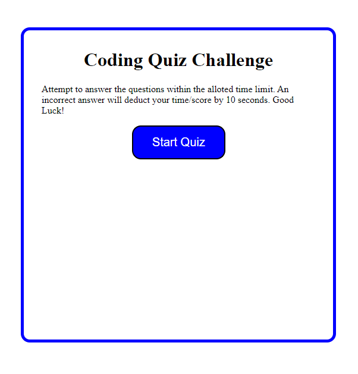

# Code Quiz
=======
# Edward Beard

## Purpose
Test your coding knowledge on this timed coding quiz challenge website. 

## Built With
* HTML
* CSS
* Javascript

## Features
This webisite was developed with the following features

* To get started click the "Start Quiz" Button. This will start the countdown timer
* Answer the multiple choice questions to the best of your ability
* If you answer the question incorrectly, 10 seconds/points will be deducted from you score
* The game is over once you complete the 6 questions OR the countown timer reaches 0. 
* Your score is the remaining time once you complete the 6 questions. 
* You can save your score by entering your initials and clicking submit
* You also have the option to clear the score & start the game over.

## Website
https://erbeard.github.io/quiz/

## Contribution
Made with ❤️ by Edward Beard

